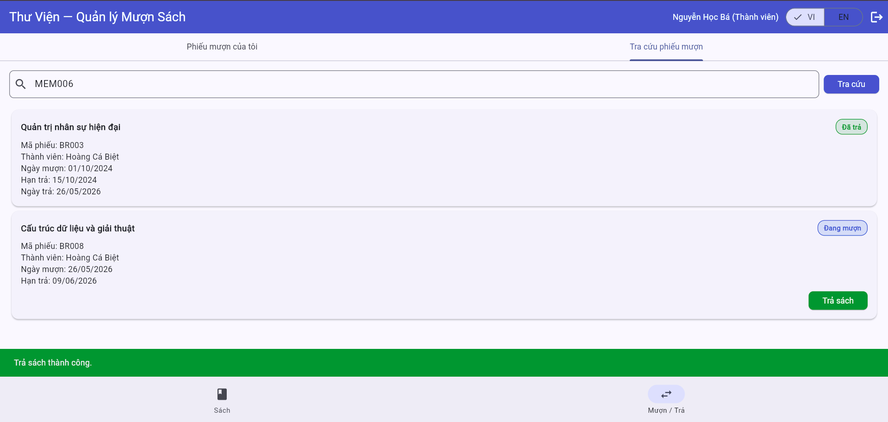
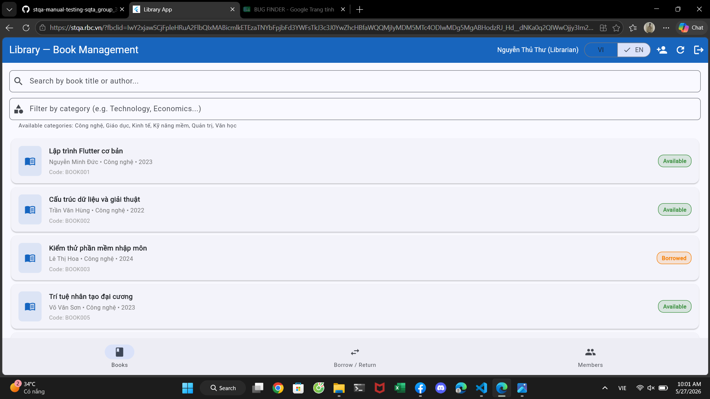

# Bug Reports — Báo cáo lỗi

> **Hướng dẫn**: Tạo 1 mục bug cho mỗi TC có kết quả **Fail**.
> Xem [examples/sample-bug-report.md](../examples/sample-bug-report.md) để hiểu cách viết bug report tốt.
> Mỗi bug cần: tiêu đề mô tả hành vi lỗi, bước tái hiện, expected vs actual, severity + giải thích.

| Information     |              |
| --------------- | ------------ |
| **Group**       | `Group 30`   |
| **Report date** | `25/05/2026` |

---

## BUG-01

| Attribute       | Details            |
| --------------- | ------------------ |
| **BUG ID**      | `BUG-01 `          |
| **Related TC**  | `TC-05`            |
| **Related REQ** | `REQ-01`           |
| **Severity**    | `High`             |
| **Reporter**    | `Nguyễn Thành Đạt` |
| **Date Found**  | `25/05/2026`       |
| **Status**      | `Open`             |

**Title:**
`Email login is case-sensitive`

**Enviroment:**

- Browser: Chrome `Version 148.0.7778.179`
- OS: `MacOS`
- UI Language: Tiếng Việt

**Prerequisites:**
`An account already exists on the system`

**Steps to Reproduce:**

1. `Step 1: Enter your email address in uppercase letters, e.g., Ba.nguyen@email.com instead of ba.nguyen@email.com`
2. `Step 2: Enter your password`
3. `Step 3: Click login`

**Expected Result:**
`The system has allowed successful login (case-insensitive for email addresses)`

**Actual Result:**
`The system could not recognize the account and reported a login error`

**Impact:**
`This directly impacts the user experience during login`

**Evidence:**

**Proposed Solution:**
`Add a function toLowerCase() to convert all emails sent from the user to lowercase before processing them in the login logic.`

---

## BUG-02

| **Attribute**   | Details                |
| --------------- | ---------------------- |
| **BUG ID**      | `BUG-02`               |
| **Related ID**  | `TC-23`                |
| **Related Req** | `REQ-04`               |
| **Severity**    | `High`                 |
| **Reporter**    | `Nguyễn Cao Hoàng Đạt` |
| **Date Found**  | `25/05/2026`           |
| **Status**      | `Open`                 |

**Title:**
`Borrowing more books than allowed`

**Enviroment:**

- Browser: Chrome `Version 148.0.7778.179`
- OS: `Window 11`
- UI Language: Vietnammese

**Prerequisites:**
`The login page has opened, the account has successfully logged in, the system is currently showing that exactly 3 books have been borrowed (reaching the maximum allowed limit), and the data has not been reset`

**Steps to Reproduce:**

1. `Account successfully logged in`
2. `Borrow any 3 books available in the library one by one`
3. `Find one more book available in the library, click icon '+' on the 4th book`

**Expected Result:**
`The system is reporting an error: the maximum borrowing limit (3 books) has been reached and a 4th book cannot be borrowed`

**Actual Result:**
`The system still allows borrowing the fourth book; no blocking notification has appeared`

**Impact:**
`Violation of core business rules, allowing borrowing beyond limits`

**Evidence:**

**Proposed Solution:**
`Check the current number of books the user is borrowing before displaying the "Borrow Book" button. If 3 books have been borrowed, disable or hide the icon "+" button`

---

## BUG-03

| **Attribute**   | Details                |
| --------------- | ---------------------- |
| **BUG ID**      | `BUG-03`               |
| **Related ID**  | `Tc-28`                |
| **Related Req** | `REQ-04`               |
| **Severity**    | `Medium`               |
| **Reporter**    | `Nguyễn Cao Hoàng Đạt` |
| **Date Found**  | `25/05/2026`           |
| **Status**      | `Open`                 |

**Title:**
`Do not change the language in the red popup notification`

**Enviroment:**

- Browser: Chrome `Version 148.0.7778.179`
- OS: `Window 11`
- UI Language: English

**Prerequisites:**
`User account logged in, system is installing a language other than Vietnamese (English)`

**Steps to Reproduce:**

1. `Step 1: Successfully log in to your account`
2. `Step 2: Go to Settings then change the interface language to English`
3. `Step 3: Perform an action that causes a red popup notification`

**Expected Result:**
`The red popup displays the correct language currently installed in the system`

**Actual Result:**
`The red popup will continue to display the content in Vietnamese, it will not switch to the selected language`

**Impact:**
`Inconsistent user experience — the interface displays the correct language, but error messages are not, causing confusion for users who cannot read Vietnamese`

**Evidence:**

**Proposed Solution:**
`The text strings in the red popup need to be included in the localization file. Ensure all error messages adhere to the selected language — do not hardcode Vietnamese`

---

## BUG-04

| **Attribute**   | Details            |
| --------------- | ------------------ |
| **BUG ID**      | `BUG-04`           |
| **Related ID**  | `TC-16, TC-17`     |
| **Related Req** | `REQ-03`           |
| **Severity**    | `High`             |
| **Reporter**    | `Nguyễn Thành Đạt` |
| **Date Found**  | `26/05/2026`       |
| **Status**      | `Open`             |

**Title:**
`Filter is case-sensitive`

**Enviroment:**

- Browser: Chrome `Version 148.0.7778.179`
- OS: `MacOS`
- UI Language: Vietnammese

**Prerequisites:**
`Login to the system successful and I can now access the Books page`

**Steps to Reproduce:**

1. `Step 1: Log in to the system (any account)`
2. `Step 2: Search using a filter that does not use uppercase letters`

**Expected Result:**
`Expect to see results showing books of the same genre, regardless of whether the filter is in uppercase or lowercase letters`

**Actual Result:**
`No results were found for the list of books filtered by that category`

**Impact:**
`Influencing product search`

**Evidence:**

**Proposed Solution:**
`Get the user filter, then use the `toLowerCase()` function to convert it to lowercase. Only then should you pass it to the function for processing`

---

## BUG-05

| **Attribute**   | Details         |
| --------------- | --------------- |
| **BUG ID**      | `BUG-05`        |
| **Related ID**  | `TC-24`         |
| **Related Req** | `REQ-04`        |
| **Severity**    | `High`          |
| **Reporter**    | `Bùi Mạnh Hiếu` |
| **Date Found**  | `25/05/2026`    |
| **Status**      | `Open`          |

**Title:**
`Account status notification popup error: Account is "Suspended" but shows as "Expired"`

**Enviroment:**

- Browser: Chrome `Version 148.0.7778.179`
- OS: `Window 10`
- UI Language: Vietnammese

**Prerequisites:**
`Login and use account with "Temporarily suspended" status`

**Steps to Reproduce:**

1. `Step 1: Log in to your account with the "Temporarily Suspended" status`
2. `Step 2: Borrow a book`

**Expected Result:**
`Expect the popup notification system to display separate alerts for each account type`

**Actual Result:**
`Error message: Incorrect account status`

**Impact:**
`Causes misunderstanding regarding member status, inconsistent status`

**Evidence:**

**Proposed Solution:**
`Check the exact enum or account status condition string returned from the API before displaying text in the notification popup, avoiding hardcoding a single error message`

---

## BUG-06

| **Attribute**   | Details       |
| --------------- | ------------- |
| **BUG ID**      | `BUG-06`      |
| **Related ID**  | `TC-53,TC-54` |
| **Related Req** | `REQ-08`      |
| **Severity**    | `High`        |
| **Reporter**    | `Đỗ Hữu Đức`  |
| **Date Found**  | `25/05/2026`  |
| **Status**      | `Open`        |

**Title:**
`Members are free to look up each other's codes`

**Enviroment:**

- Browser: Chrome `Version 148.0.7778.179`
- OS: `Window 11`
- UI Language: `English & Vietnammese`

**Prerequisites:**
`The member account has logged into the system, and the system is activating the book borrowing code/member code management function`

**Steps to Reproduce:**

1. `Step 1: Log in to the system using your member account (e.g., biet.hoang@email.com)`
2. `Step 2: Access the function to look up or search for member information/book borrowing code`
3. `Step 3: Search for information or codes of other members (e.g., Enter code MEM002 of account ba.nguyen@email.com)`

**Expected Result:**
`Members are only permitted to view their own loan slips and are absolutely NOT allowed to view other members' loan slips`

**Actual Result:**
`The system does not restrict access, allowing members to easily look up each other's information and book borrowing codes`

**Impact:**
`This poses a serious risk to account security, violates personal identification rules, and leads to user data leaks.`

**Evidence:**

**Proposed Solution:**
`Implement strict permission control on both the client-side (hide other users' search boxes) and server-side (check session/token; if the ID requesting the lookup does not match the login ID and is not the Librarian/Admin role, immediately reject the request)`

---

## BUG-07

| **Attribute**   | Details                |
| --------------- | ---------------------- |
| **BUG ID**      | `BUG-07`               |
| **Related ID**  | `TC-30`                |
| **Related Req** | `REQ-05`               |
| **Severity**    | `High`                 |
| **Reporter**    | `Nguyễn Cao Hoàng Đạt` |
| **Date Found**  | `25/05/2026`           |
| **Status**      | `Open`                 |

**Title:**
`Do not display overdue book return warnings when returns are overdue`

**Enviroment:**

- Browser: Chrome `Version 148.0.7778.179`
- OS: `Window 11`
- UI Language: `English & Vietnammese`

**Prerequisites:**
`Account successfully logged in, at least one book is overdue for return in the borrowing list`

**Steps to Reproduce:**

1. `Step 1: Log in to your account successfully`
2. `Step 2: Go to the "Borrowed Books" section`
3. `Step 3: Confirm that there are books that are overdue. Click "Return Book" on that overdue book`
4. `Step 4: Confirm returning the book`

**Expected Result:**
`After returning, the system must display a warning notification like "Book is overdue by X days, you may be fined" so users are aware`

**Actual Result:**
`The book return process is normal; no warnings or penalty notices are displayed`

**Impact:**
`Users are unaware of being fined, leading to surprise and complaints. Librarians have no basis to notify them of the fine because the system doesn't record it. This affects the transparency of the library system`

**Evidence:**

**Proposed Solution:**
`Add a warning popup before confirming overdue book returns, displaying the number of days late and the corresponding penalty fee. The backend should also calculate and return the penalty fee information along with the response for overdue book returns, and save the penalty history to the database for librarians to review`

---

## BUG-08

| **Attribute**   | Details           |
| --------------- | ----------------- |
| **BUG ID**      | `BUG-08`          |
| **Related ID**  | `TC-26`           |
| **Related Req** | `REQ-04`          |
| **Severity**    | `Low`             |
| **Reporter**    | `Hoàng Thành Đạt` |
| **Date Found**  | `25/05/2026`      |
| **Status**      | `Open`            |

**Title:**
`Error displaying the number of books currently borrowed in the Members section; books that are past the borrowing deadline are still showing as borrowed: 0`

**Enviroment:**

- Browser: Chrome `Version 148.0.7778.179`
- OS: `Window 11`
- UI Language: `Vietnammese`

**Prerequisites:**
`The login page has opened, the account has successfully logged in, and the system is currently in the Borrow/Return section`

**Steps to Reproduce:**

1. `Step 1: Log in to your account successfully`
2. `Step 2: Borrow any book and set your borrowing status to overdue`

**Expected Result:**
`When books become overdue, the system needs a separate counting mechanism or a clear "Overdue" status message instead of ignoring the counter`

**Actual Result:**
`System error: When a book becomes overdue, the number of borrowed books displayed is still 0`

**Impact:**
`This creates confusion and makes it difficult for users to distinguish between books that are still borrowed within the repayment period and books that are overdue`

**Evidence:**

**Proposed Solution:**
`Compare the current timestamp and the book return due date. If the current timestamp is greater than the due date, the system must update the record status to "Overdue" and add it to the appropriate statistical counter on the UI`

---

## BUG-09

| **Attribute**   | Details         |
| --------------- | --------------- |
| **BUG ID**      | `BUG-09`        |
| **Related ID**  | `TC-27`         |
| **Related Req** | `REQ-04`        |
| **Severity**    | `High`          |
| **Reporter**    | `Bùi Mạnh Hiếu` |
| **Date Found**  | `25/05/2026`    |
| **Status**      | `Open`          |

**Title:**
`Website blank page error + data loss when spamming the book borrowing section multiple times`

**Enviroment:**

- Browser: Chrome `Version: 131.0.5877.97`
- OS: `Opera One`
- UI Language: `Vietnammese`

**Prerequisites:**
`I have successfully logged into my account and am interacting with the website`

**Steps to Reproduce:**

1. `Step 1: Log in with an available account`
2. `Step 2: Spam the "Borrow" button multiple times after clicking the plus sign`

**Expected Result:**
`The system needs to prevent users from spamming repeatedly to avoid server errors or data inconsistencies`

**Actual Result:**
`Users are still spamming clicks repeatedly, leading to request conflicts that cause blank pages and loss of displayed data`

**Impact:**
`This causes local overload on the server receiving the request and degrades the core user experience`

**Evidence:**

**Proposed Solution:**
`Add the **disabled** attribute to the book borrowing button immediately after the first click to prevent users from continuing to spam requests while the server is processing data`

---

## BUG-10

| **Attribute**   | Details      |
| --------------- | ------------ |
| **BUG ID**      | `BUG-10`     |
| **Related ID**  | `TC-31`      |
| **Related Req** | `REQ-05`     |
| **Severity**    | `Medium`     |
| **Reporter**    | `Đỗ Hữu Đức` |
| **Date Found**  | `25/05/2026` |
| **Status**      | `Open`       |

**Title:**
`Users can return books at their own discretion without needing confirmation from the librarian`

**Enviroment:**

- Browser: Chrome `Version 148.0.7778.179`
- OS: `Window 11`
- UI Language: `English & Vietnammese`

**Prerequisites:**
`The member currently has the book listed as "Borrowed"`

**Steps to Reproduce:**

1. `Step 1: Log in to your member account`
2. `Step 2: Access the section for managing borrowed books or borrowing/returning history`
3. `Step 3: Click the "Return Book" button or perform the "Return Book" action from the user interface`

**Expected Result:**
`The user's action of returning a book is simply submitting a "Book Return Request". The book is only considered returned after the librarian receives it, checks its physical condition, and confirms the return in the system`

**Actual Result:**
`The system allows users to independently return books, and the status changes to "successfully returned" without requiring verification or confirmation from the librarian`

**Impact:**
`Data discrepancies exist between the physical book inventory and the system. Members may commit fraud by clicking 'return' on the system but not returning the actual books, resulting in loss of library assets`

**Evidence:**

**Proposed Solution:**
`Processing flow: When the user clicks "Return Book," the status changes to "Waiting for Librarian Confirmation." Only accounts with Librarian privileges have the authority to approve the completion of the book return process`

---

## BUG-11

| **Attribute**   | Details            |
| --------------- | ------------------ |
| **BUG ID**      | `BUG-11`           |
| **Related ID**  | `TC-34`            |
| **Related Req** | `REQ-05`           |
| **Severity**    | `High`             |
| **Reporter**    | `Nguyễn Thành Đạt` |
| **Date Found**  | `25/05/2026`       |
| **Status**      | `Open`             |

**Title:**
`Error: The popup appears twice, successfully and unsuccessfully, when pressing the "return book" button twice`

**Enviroment:**

- Browser: Chrome `Version 148.0.7778.179`
- OS: `MacOS`
- UI Language: `Vietnammese`

**Prerequisites:**
`The account meets the requirements (is active and has the ability to borrow and return books) and has books currently borrowed`

**Steps to Reproduce:**

1. `Step 1: Log in to your active account`
2. `Step 2: Go to the borrowing/returning section`
3. `Step 3: Press the book return button repeatedly`

**Expected Result:**
`Only one successful popup will appear when you click "Return Book"`

**Actual Result:**
`The success popup is displayed first, then the error popup appears immediately.`

**Impact:**
`This can cause misunderstanding for users when performing double-clicking or pressing the button too quickly.`

**Detailslỗi:**
`After repeatedly clicking the book return button, two success and failure pop-ups are displayed, resulting in two requests being sent to the server. This causes the server to receive and execute unnecessary requests, potentially leading to system data errors and user misunderstandings`

**Evidence:**

**Proposed Solution:**
`While processing requests, the displayed button should be disabled and a loading effect added to enhance user experience and block further client interactions until a response is received from the server. This reduces the number of unnecessary requests sent to the server`

---

## BUG-12

| **Attribute**   | Details         |
| --------------- | --------------- |
| **BUG ID**      | `BUG-12`        |
| **Related ID**  | `TC-45`         |
| **Related Req** | `REQ-07`        |
| **Severity**    | `Medium`        |
| **Reporter**    | `Bùi Mạnh Hiếu` |
| **Date Found**  | `25/05/2026`    |
| **Status**      | `Open`          |

**Title:**
`Entering an existing email address results in a "Invalid email address" message instead of "Email address already exists"`

**Enviroment:**

- Browser: Chrome `Version 148.0.7778.179`
- OS: `Windows 10`
- UI Language: `Vietnammese`

**Prerequisites:**
`Login to librarian account successful`

**Steps to Reproduce:**

1. `Step 1: Log in to your librarian account`
2. `Step 2: Add a member`
3. `Step 3: Enter an existing email address`

**Expected Result:**
`The system returns a clear error message: "This email address is already registered on the system" so that the operator understands the reason`

**Actual Result:**
`The system displays a generic message saying "Invalid email" which can easily lead to the misconception that the email string structure is incorrect`

**Impact:**
`This causes obstruction and confusion for librarians during the process of managing and creating new member records`

**Evidence:**

**Proposed Solution:**
`Update the validation logic on both the client-side and server-side. When receiving database duplicate error codes (e.g., Unique Constraint error from the database), the system needs to map the correct corresponding message instead of including it in the format validation`

---

## BUG-13

| **Attribute**   | Details      |
| --------------- | ------------ |
| **BUG ID**      | `BUG-13`     |
| **Related ID**  | `TC-01`      |
| **Related Req** | `REQ-05`     |
| **Severity**    | `High`       |
| **Reporter**    | `Đỗ Hữu Đức` |
| **Date Found**  | `26/05/2026` |
| **Status**      | `Open`       |

**Title:**
`Allows members to renew or return other people's books at their own discretion`

**Enviroment:**

- Browser: Chrome `Version 148.0.7778.179`
- OS: `Window 11`
- UI Language: `Vietnammese & English`

**Prerequisites:**

- `The member's account has successfully logged into the system`
- `Another member (Member B) is borrowing books and has inadvertently revealed their borrowing code or borrowing ID`

**Steps to Reproduce:**

1. `Step 1: Log in to the system using member A's account`
2. `Step 2: Access the Borrow/Return section (Look up loan slip) and enter member B's code`
3. `Step 3: Proceed to return the book or renew the loan`

**Expected Result:**
`The system must block this action and report a permission error (403 Forbidden). Only the account holder borrowing the book (or the librarian/administrator) has the right to send the request or process the loan slip`

**Actual Result:**
`The system allows member A to independently return books (or send a successful book return API command) for books borrowed by member B`

**Impact:**
`Destroying other users' borrowing and returning data. Causing serious logical errors in the book borrowing process management, resulting in user B losing the book in reality but the system recording it as returned, causing disputes and difficulties for librarians when cross-referencing inventory data`

**Evidence:**

**Proposed Solution:**
`Add backend authorization checks for APIs related to borrowing/returning/renewing books: Ensure the Session/Token ID of the user sending the request matches the UserID recorded in the database for that book's borrowing history`

---

## BUG-14

| **Attribute**   | Details           |
| --------------- | ----------------- |
| **BUG ID**      | `BUG-14`          |
| **Related ID**  | `TC-01`           |
| **Related Req** | `REQ-03`          |
| **Severity**    | `Low`             |
| **Reporter**    | `Hoàng Thành Đạt` |
| **Date Found**  | `25/05/2026`      |
| **Status**      | `Open`            |

**Title:**
`Category translation error: when translating from English, the text remains in Vietnamese`

**Enviroment:**

- Browser: Chrome `Version 148.0.7778.179`
- OS: `Window 11`
- UI Language: `English`

**Prerequisites:**
`The login page has opened, the account has successfully logged in, and the interface has switched to English`

**Steps to Reproduce:**

1. `Step 1: Log in to your account successfully`
2. `Step 2: Switch the interface to English`

**Expected Result:**
`When switching the interface to English, all text labels and static category data displayed on the website must be translated into English accordingly`

**Actual Result:**
`The system's interface has changed, but the category list "Available Categories: Technology, Education, Economics, Soft Skills, Management, Literature" retains its original content displayed in Vietnamese`

**Impact:**
`This leads to a lack of consistency in the multilingual (localization) experience, hindering accessibility for users who do not speak Vietnamese`

**Evidence:**

**Proposed Solution:**
`Includes an array of categories in the system's multilingual data localization file. When the user switches languages, triggers the map function to retrieve the exact corresponding English translation from the language file`

---

## BUG-15

| **Attribute**   | Details           |
| --------------- | ----------------- |
| **BUG ID**      | `BUG-15`          |
| **Related ID**  | `TC-44`           |
| **Related Req** | `REQ-07`          |
| **Severity**    | `High`            |
| **Reporter**    | `Hoàng Thành Đạt` |
| **Date Found**  | `25/05/2026`      |
| **Status**      | `Open`            |

**Title:**
`Error: Member added with invalid email address formatted incorrectly`

**Enviroment:**

- Browser: Chrome `Version 148.0.7778.179`
- OS: `Window 11`
- UI Language: `Vietnammese`

**Prerequisites:**
`The login page is open. Log in using your librarian account and go to the "add member" section`

**Steps to Reproduce:**

1. `Step 1: Log in successfully using your librarian account`
2. `Step 2: Go to the "Add Member" section`
3. `Step 3: Enter a member with an invalid email address (e.g., hoangthanhdat212@gmail.com instead of hoangthanhdat212@gmail.com)`

**Expected Result:**
`The system activates a validator to validate email formatting, blocking data submission attempts and displaying an error message indicating incorrect email structure`

**Actual Result:**
`The system bypassed the check and added this invalid email address to the database as usual`

**Impact:**
`This creates difficulties and inaccuracies in librarians' management of user data and clutters the communication system`

**Evidence:**

**Proposed Solution:**
`Implementing Regex rigorously checks email format on both the front-end before submission and the back-end before writing data. It also involves sending activation codes/links to the email address to verify the account and ensure the mailbox exists`

---

## BUG-16

| **Attribute**   | Details                |
| --------------- | ---------------------- |
| **BUG ID**      | `BUG-16`               |
| **Related ID**  | `TC-19`                |
| **Related Req** | `REQ-06`               |
| **Severity**    | `High`                 |
| **Reporter**    | `Nguyễn Cao Hoàng Đạt` |
| **Date Found**  | `25/05/2026`           |
| **Status**      | `Open`                 |

**Title:**
`Incorrect number of overdue books displayed when pressing the 'Check Overdue' button a second time`

**Enviroment:**

- Browser: Chrome `Version 148.0.7778.179`
- OS: `Window 11`
- UI Language: `English & Vietnammese`

**Prerequisites:**
`The librarian account has been logged in, and the system has at least one book that is overdue; it is currently on the overdue book management/checking screen`

**Steps to Reproduce:**

1. `Step 1: Successfully log in to your librarian account`
2. `Step 2: Go to the "Check Overdue" section. Click the "Check Overdue" button the first time → record the number of overdue books displayed`
3. `Step 3: Click the "Check Overdue" button a second time`

**Expected Result:**
`Each time the "Check for Overdue Date" button is clicked, it must return the same accurate and consistent result if the system data has not changed`

**Actual Result:**
`The second click displayed an incorrect number of overdue books, different from the first, even though there was no data fluctuation between the two interactions`

**Impact:**
`This reduces the reliability of the system, confusing librarians who don't know which results to trust. It can lead to missed or incorrect processing of users' overdue book records`

**Evidence:**

**Proposed Solution:**
`Review the client-side data processing flow: ensure that the list storage structure or override counter is cleaned (cleared/reset) before receiving the new data array from the API to avoid appending (merging redundant data). The server-side needs to commit to providing independent data snapshots at the time of the request`
