# Test Execution — Kết quả thực thi kiểm thử

> **Hướng dẫn**: Chạy từng TC trên hệ thống https://stqa.rbc.vn, ghi lại kết quả thực tế.
> Kết luận: **Pass** (kết quả đúng), **Fail** (kết quả sai → tạo bug report), **Blocked** (không thực hiện được vì lỗi khác chặn), **Not Run** (chưa chạy).

| Thông tin         |                                          |
| ----------------- | ---------------------------------------- |
| **Nhóm**          | `<!-- Group 30 -->`                      |
| **Ngày thực thi** | `<!-- 29/05/2026 -->`                    |
| **Trình duyệt**   | Chrome `<!-- version 148.0.7778.181 -->` |
| **Hệ điều hành**  | `<!-- Windows -->`                       |

---

## Kết quả chi tiết

| Mã TC | Nhóm chức năng                 | Kết quả mong đợi (tóm tắt)                                                                                                                                                                                 | Kết quả thực tế                                                                                                                                                                                            | Kết luận | Minh chứng                                                                         |  Bug   |
| :---: | ------------------------------ | ---------------------------------------------------------------------------------------------------------------------------------------------------------------------------------------------------------- | ---------------------------------------------------------------------------------------------------------------------------------------------------------------------------------------------------------- | :------: | ---------------------------------------------------------------------------------- | :----: |
| TC-01 | REQ-01 — Login                 | Redirects to home page and displays name Nguyễn Học Bá + role Thành viên / member on app bar                                                                                                               | Redirects to home page and displays name Nguyễn Học Bá + role Thành viên / member on app bar                                                                                                               |   Pass   |                                                                                    |        |
| TC-02 | REQ-01 — Login                 | Displays login error message "Member not found" if email is incorrect                                                                                                                                      | Displays login error message "Member not found" if email is incorrect                                                                                                                                      |   Pass   |                                                                                    |        |
| TC-03 | REQ-01 — Login                 | Displays error message "Incorrect password"                                                                                                                                                                | Displays error message "Incorrect password"                                                                                                                                                                |   Pass   |                                                                                    |        |
| TC-04 | REQ-01 — Login                 | Displays error message "Please enter account and password"                                                                                                                                                 | Displays error message "Please enter account and password"                                                                                                                                                 |   Pass   |                                                                                    |        |
| TC-05 | REQ-01 — Login                 | Redirects to home page and displays username + role on app bar                                                                                                                                             | The system could not recognize the account and reported a login error                                                                                                                                      |   Fail   |                                                      | BUG-01 |
| TC-06 | REQ-01 — Login                 | Redirects to home page and displays username + role on app bar                                                                                                                                             | Redirects to home page and displays username + role on app bar                                                                                                                                             |   Pass   |                                                                                    |        |
| TC-07 | REQ-02 — View Book List        | Displays the complete book list, not empty and no errors                                                                                                                                                   | Displays the complete book list, not empty and no errors                                                                                                                                                   |   Pass   |                                                                                    |        |
| TC-08 | REQ-02 — View Book List        | Each book displays all: Title, Author, Genre, Publication Year, Status                                                                                                                                     | Each book displays all: Title, Author, Genre, Publication Year, Status                                                                                                                                     |   Pass   |                                                                                    |        |
| TC-09 | REQ-02 — View Book List        | Both books display "Borrowed" status                                                                                                                                                                       | Both books display "Borrowed" status                                                                                                                                                                       |   Pass   |                                                                                    |        |
| TC-10 | REQ-02 — View Book List        | Both books display "Lost" status                                                                                                                                                                           | Both books display "Lost" status                                                                                                                                                                           |   Pass   |                                                                                    |        |
| TC-11 | REQ-03 — Search & Filter Books | The list shows books with titles containing Linux: Linux Operating System, other books are not included in the list                                                                                        | The list shows books with titles containing Linux: Linux Operating System, other books are not included in the list                                                                                        |   Pass   |                                                                                    |        |
| TC-12 | REQ-03 — Search & Filter Books | The list displays books by author Ly Van Tai; books by other authors are not included in the list                                                                                                          | The list displays books by author Ly Van Tai; books by other authors are not included in the list                                                                                                          |   Pass   |                                                                                    |        |
| TC-13 | REQ-03 — Search & Filter Books | The returned list is empty with the message No books found                                                                                                                                                 | The returned list is empty with the message No books found                                                                                                                                                 |   Pass   |                                                                                    |        |
| TC-14 | REQ-03 — Search & Filter Books | The returned list is empty with the message No books found                                                                                                                                                 | The returned list is empty with the message No books found                                                                                                                                                 |   Pass   |                                                                                    |        |
| TC-15 | REQ-03 — Search & Filter Books | The returned list is empty with the message No books found                                                                                                                                                 | The returned list is empty with the message No books found                                                                                                                                                 |   Pass   |                                                                                    |        |
| TC-16 | REQ-03 — Search & Filter Books | The list shows books with titles containing Linux: Linux Operating System, other books are not included in the list                                                                                        | No results were found for the list of books filtered by that category                                                                                                                                      |   Fail   | 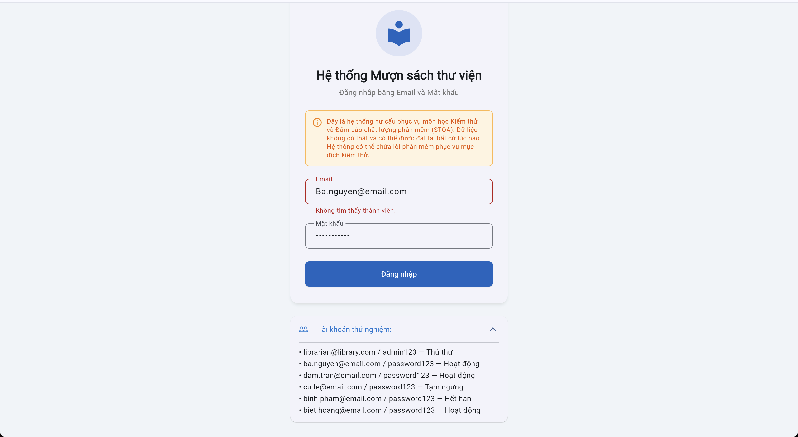                                                     | BUG-04 |
| TC-17 | REQ-03 — Search & Filter Books | The list shows books with titles containing LINUX: Linux Operating System, other books are not included in the list                                                                                        | No results were found for the list of books filtered by that category                                                                                                                                      |   Fail   |                                                      | BUG-04 |
| TC-18 | REQ-03 — Search & Filter Books | The list of books displayed includes titles categorized as Technology                                                                                                                                      | The list of books displayed includes titles categorized as Technology                                                                                                                                      |   Pass   |                                                                                    |        |
| TC-19 | REQ-03 — Search & Filter Books | The returned list is empty with the message No books found                                                                                                                                                 | The second click displayed an incorrect number of overdue books, different from the first, even though there was no data fluctuation between the two interactions                                          |   Fail   | 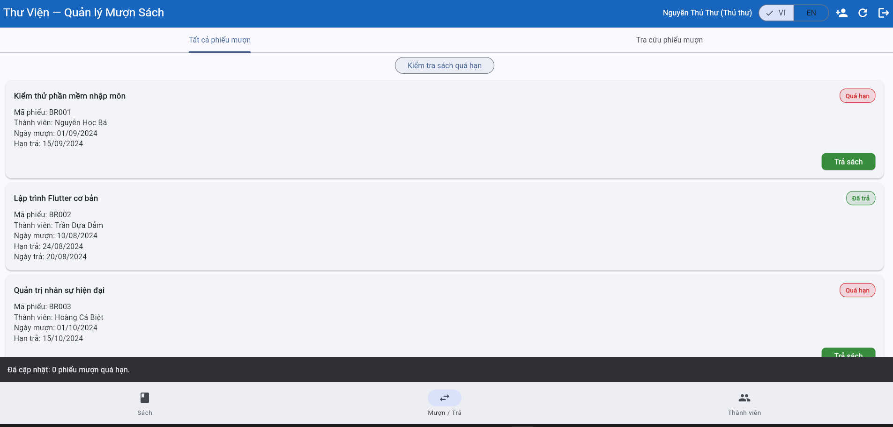                                                     | BUG-16 |
| TC-20 | REQ-03 — Search & Filter Books | The list of books displayed includes titles categorized as công nghệ.                                                                                                                                      | The list of books displayed includes titles categorized as công nghệ.                                                                                                                                      |   Pass   |                                                                                    |        |
| TC-21 | REQ-03 — Search & Filter Books | Case 1: The list displays all books containing Linux and all books belonging to the Technology category (OR). Case 2: Only displays books containing Linux and belonging to the Technology category (AND). | Case 1: The list displays all books containing Linux and all books belonging to the Technology category (OR). Case 2: Only displays books containing Linux and belonging to the Technology category (AND). |   Pass   |                                                                                    |        |
| TC-22 | REQ-03 — Search & Filter Books | Case 1: The list displays all books containing Linux and all books in the Technology category (OR). Case 2: Returns an empty list and displays the message No books found (AND).                           | Case 1: The list displays all books containing Linux and all books in the Technology category (OR). Case 2: Returns an empty list and displays the message No books found (AND).                           |   Pass   |                                                                                    |        |
| TC-23 | REQ-04 — Borrow Book           | The borrowing request was rejected; a message was displayed stating "You have reached the limit of 3 borrowed books".                                                                                      | The system still allows borrowing the fourth book; no blocking notification has appeared                                                                                                                   |   Fail   | 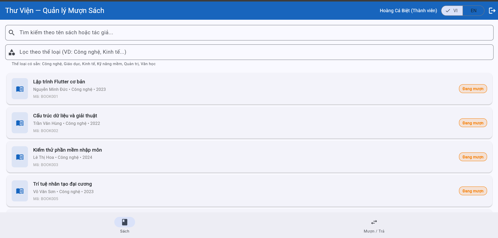                                                     | BUG-02 |
| TC-24 | REQ-04 — Borrow Book           | The system rejected the request with a clear message stating the reason: "Account is temporarily suspended."                                                                                               | Error message: Incorrect account status                                                                                                                                                                    |   Fail   |                                                      | BUG-05 |
| TC-25 | REQ-04 — Borrow Book           | The system rejected the request with a clear message stating the reason: "Account has expired."                                                                                                            | The system rejected the request with a clear message stating the reason: "Account has expired."                                                                                                            |   Pass   |                                                                                    |        |
| TC-26 | REQ-04 — Borrow Book           | The number of books currently borrowed is displayed correctly and matches the actual number in the "Books Currently Borrowed" section                                                                      | System error: When a book becomes overdue, the number of borrowed books displayed is still 0                                                                                                               |   Fail   | 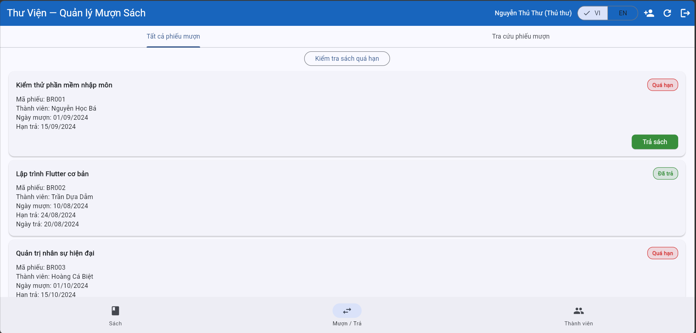, 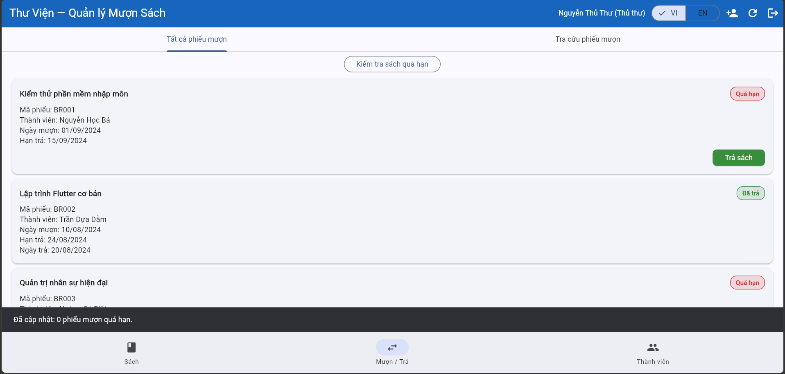               | BUG-08 |
| TC-27 | REQ-04 — Borrow Book           | The system processes the loan only once; there's no blank screen and no data loss                                                                                                                          | Users are still spamming clicks repeatedly, leading to request conflicts that cause blank pages and loss of displayed data                                                                                 |   Fail   | 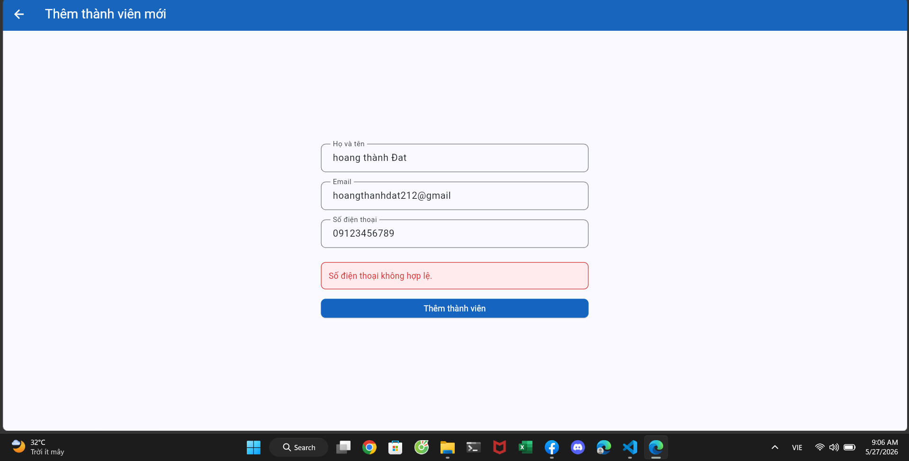                                                     | BUG-09 |
| TC-28 | REQ-04 — Borrow Book           | The error message popup will display in the correct language currently selected.                                                                                                                           | The red popup will continue to display the content in Vietnamese, it will not switch to the selected language                                                                                              |   Fail   | 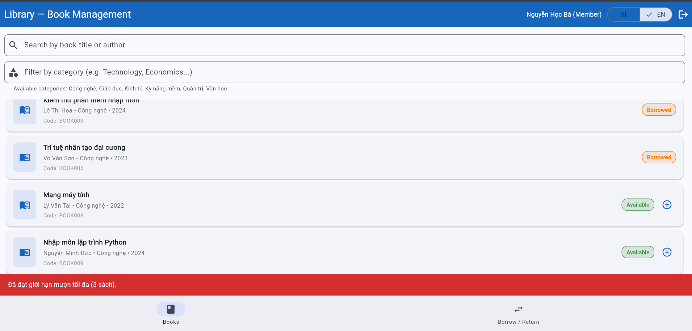                                                     | BUG-03 |
| TC-29 | REQ-05 — Return Book           | The book return was successful, the receipt status changed to "Returned" and the book became "Available"                                                                                                   | The book return was successful, the receipt status changed to "Returned" and the book became "Available"                                                                                                   |   Pass   |                                                                                    |        |
| TC-30 | REQ-05 — Return Book           | Upon successful return of the book, the receipt status changes to "Returned" and a clear overdue warning is displayed on the screen                                                                        | The book return process is normal; no warnings or penalty notices are displayed                                                                                                                            |   Fail   | 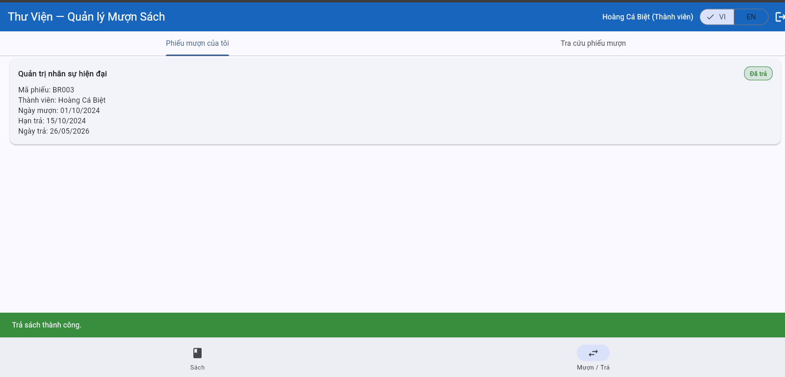                                                     | BUG-07 |
| TC-31 | REQ-05 — Return Book           | The system does not display the "Return Book" button on the individual loan slip line                                                                                                                      | The system allows users to independently return books, and the status changes to "successfully returned" without requiring verification or confirmation from the librarian                                 |   Fail   | 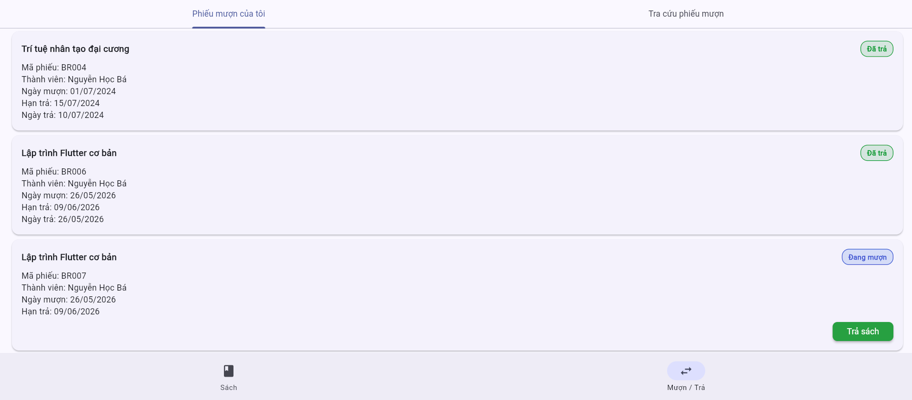                                                     | BUG-10 |
| TC-32 | REQ-05 — Return Book           | The system refuses to process the request, does not allow the return button to be pressed, or the button is completely disabled                                                                            | The system refuses to process the request, does not allow the return button to be pressed, or the button is completely disabled                                                                            |   Pass   |                                                                                    |        |
| TC-33 | REQ-05 — Return Book           | The word "Returned" will no longer appear on returned loan slips                                                                                                                                           | The word "Returned" will no longer appear on returned loan slips                                                                                                                                           |   Pass   |                                                                                    |        |
| TC-34 | REQ-05 — Return Book           | The system only accepts and processes the first click request, displaying only one popup message: "Book returned successfully".                                                                            | The success popup is displayed first, then the error popup appears immediately.                                                                                                                            |   Fail   | 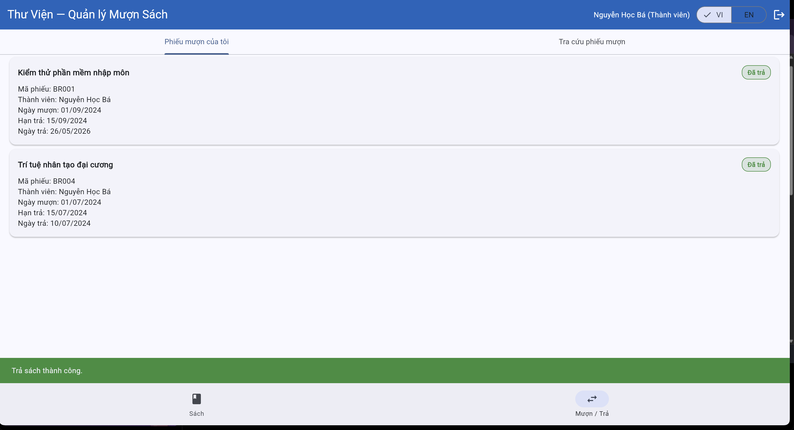, 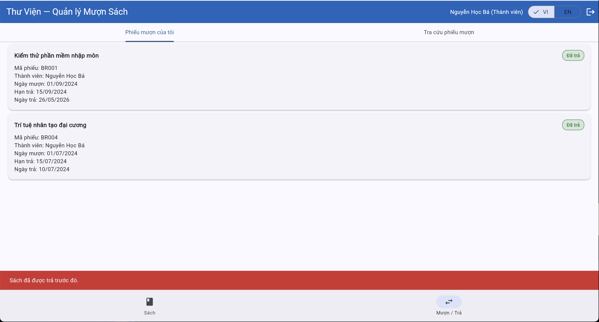             | BUG-11 |
| TC-35 | REQ-05 — Return Book           | The system is required to display a clear overdue warning on the interface screen                                                                                                                          | The system is required to display a clear overdue warning on the interface screen                                                                                                                          |   Pass   |                                                                                    |        |
| TC-36 | REQ-06 — Overdue Handling      | The loan slip system marks the loan slip as "Overdue"                                                                                                                                                      | The loan slip system marks the loan slip as "Overdue"                                                                                                                                                      |   Pass   |                                                                                    |        |
| TC-37 | REQ-06 — Overdue Handling      | The system does not mark loan slips as "Overdue"                                                                                                                                                           | The system does not mark loan slips as "Overdue"                                                                                                                                                           |   Pass   |                                                                                    |        |
| TC-38 | REQ-06 — Overdue Handling      | The system does not mark loan slips as "Overdue"                                                                                                                                                           | The system does not mark loan slips as "Overdue"                                                                                                                                                           |   Pass   |                                                                                    |        |
| TC-39 | REQ-06 — Overdue Handling      | The system updates the status of voucher BR001 from "On loan" to "Overdue" and displays a successful update message                                                                                        | The system updates the status of voucher BR001 from "On loan" to "Overdue" and displays a successful update message                                                                                        |   Pass   |                                                                                    |        |
| TC-40 | REQ-06 — Overdue Handling      | The system only displays BR001 and BR003 in the overdue list                                                                                                                                               | The system only displays BR001 and BR003 in the overdue list                                                                                                                                               |   Pass   |                                                                                    |        |
| TC-41 | REQ-06 — Overdue Handling      | The system displays the message "No overdue books"                                                                                                                                                         | The system displays the message "No overdue books"                                                                                                                                                         |   Pass   |                                                                                    |        |
| TC-42 | REQ-06 — Overdue Handling      | The system did not add BR002 to the list of overdue books                                                                                                                                                  | The system did not add BR002 to the list of overdue books                                                                                                                                                  |   Pass   |                                                                                    |        |
| TC-43 | REQ-06 — Overdue Handling      | The system did not update the ticket status to "Overdue"                                                                                                                                                   | The system did not update the ticket status to "Overdue"                                                                                                                                                   |   Pass   |                                                                                    |        |
| TC-44 | REQ-06 — Overdue Handling      | The system updates the status of slip BR005 from "Currently Borrowed" to "Overdue".                                                                                                                        | The system bypassed the check and added this invalid email address to the database as usual                                                                                                                |   Fail   | 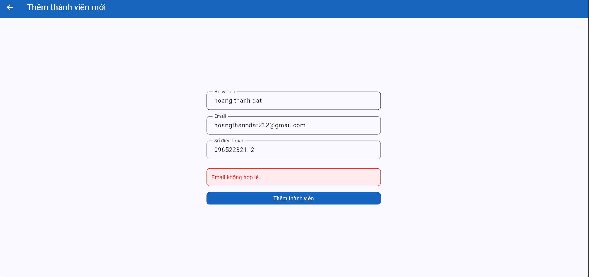, 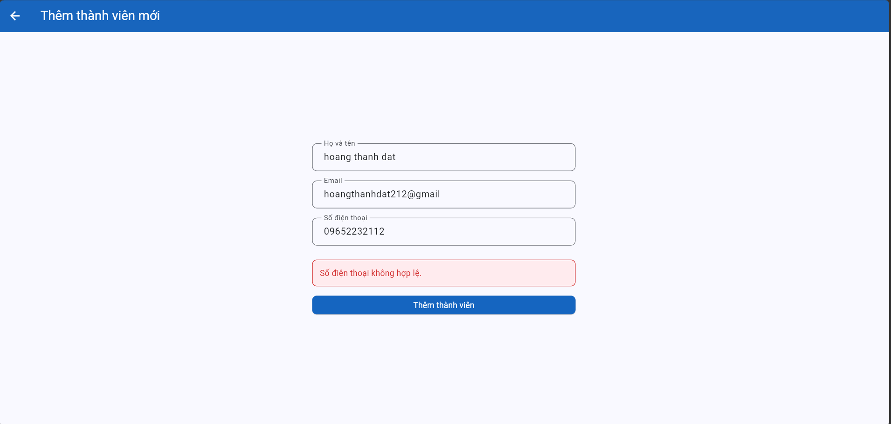 | BUG-15 |
| TC-45 | REQ-06 — Overdue Handling      | The system maintains the "Overdue" status and does not create duplicate records or updates.                                                                                                                | The system displays a generic message saying "Invalid email" which can easily lead to the misconception that the email string structure is incorrect                                                       |   Fail   |                                                      | BUG-12 |
| TC-46 | REQ-07 — Member Management     | New member successfully created and displayed in the list.                                                                                                                                                 | New member successfully created and displayed in the list.                                                                                                                                                 |   Pass   |                                                                                    |        |
| TC-47 | REQ-07 — Member Management     | The system refuses to save, displaying an invalid email message (missing a period '.').                                                                                                                    | The system refuses to save, displaying an invalid email message (missing a period '.').                                                                                                                    |   Pass   |                                                                                    |        |
| TC-48 | REQ-07 — Member Management     | The system refuses to save and displays an error message indicating the email address already exists.                                                                                                      | The system refuses to save and displays an error message indicating the email address already exists.                                                                                                      |   Pass   |                                                                                    |        |
| TC-49 | REQ-07 — Member Management     | Member successfully created with valid email address a@b.c.                                                                                                                                                | Member successfully created with valid email address a@b.c.                                                                                                                                                |   Pass   |                                                                                    |        |
| TC-50 | REQ-07 — Member Management     | The system refuses to save, displaying an invalid email error message (missing @).                                                                                                                         | The system refuses to save, displaying an invalid email error message (missing @).                                                                                                                         |   Pass   |                                                                                    |        |
| TC-51 | REQ-07 — Member Management     | The system refused to save, requesting that the blank field be filled in completely.                                                                                                                       | The system refused to save, requesting that the blank field be filled in completely.                                                                                                                       |   Pass   |                                                                                    |        |
| TC-52 | REQ-07 — Member Management     | The system blocks direct access, hides function buttons, or reports permission errors.                                                                                                                     | The system blocks direct access, hides function buttons, or reports permission errors.                                                                                                                     |   Pass   |                                                                                    |        |
| TC-53 | REQ-07 — Member Management     | New member successfully created and displayed in the list.                                                                                                                                                 | The system does not restrict access, allowing members to easily look up each other's information and book borrowing codes                                                                                  |   Fail   | 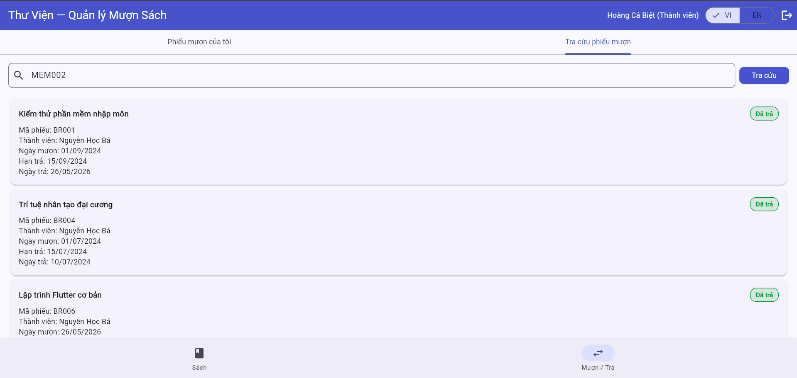                                                     | BUG-06 |
| TC-54 | REQ-07 — Member Management     | System refuses to save, reports phone number format error (only accepts digits).                                                                                                                           | The system does not restrict access, allowing members to easily look up each other's information and book borrowing codes                                                                                  |   Fail   |                                                      | BUG-06 |
| TC-55 | REQ-08 - Borrow Record Lookup  | The list displays all loan slips for all members in the system.                                                                                                                                            | The list displays all loan slips for all members in the system.                                                                                                                                            |   Pass   |                                                                                    |        |
| TC-56 | REQ-08 - Borrow Record Lookup  | The list ONLY displays loan slips belonging to the account dam.tran@email.com. Absolutely no slips from other members are displayed.                                                                       | The list ONLY displays loan slips belonging to the account dam.tran@email.com. Absolutely no slips from other members are displayed.                                                                       |   Pass   |                                                                                    |        |
| TC-57 | REQ-08 - Borrow Record Lookup  | The system blocks access, returns empty results (not found), or displays the error message "You do not have permission to view this loan ticket".                                                          | The system blocks access, returns empty results (not found), or displays the error message "You do not have permission to view this loan ticket".                                                          |   Pass   |                                                                                    |        |
| TC-58 | REQ-08 - Borrow Record Lookup  | Each loan slip displays all 5 information fields completely and accurately: Slip Code, Book Borrowed, Borrowing Date, Expiration Date, Status (Borrowed / Returned / Overdue).                             | Each loan slip displays all 5 information fields completely and accurately: Slip Code, Book Borrowed, Borrowing Date, Expiration Date, Status (Borrowed / Returned / Overdue).                             |   Pass   |

---

## Tổng hợp kết quả

| Chỉ số            | Giá trị |
| ----------------- | ------- |
| Tổng số test case | `58`    |
| Pass              | `42`    |
| Fail              | `16`    |
| Blocked           | `00`    |
| Not Run           | `00`    |
| **Tỷ lệ Pass**    | `72.4%` |

### Kết quả theo nhóm chức năng

|  Nhóm  | Tổng TC | Pass | Fail | Tỷ lệ Pass |
| :----: | :-----: | :--: | :--: | :--------: |
| REQ-01 |   06    |  05  |  01  |   83.3%    |
| REQ-02 |   04    |  04  |  00  |    100%    |
| REQ-03 |   12    |  09  |  03  |    75%     |
| REQ-04 |   06    |  01  |  05  |   16.7%    |
| REQ-05 |   07    |  04  |  03  |   57.1%    |
| REQ-06 |   10    |  08  |  02  |    80%     |
| REQ-07 |   09    |  07  |  02  |   77.8%    |
| REQ-08 |   04    |  04  |  00  |    100%    |
